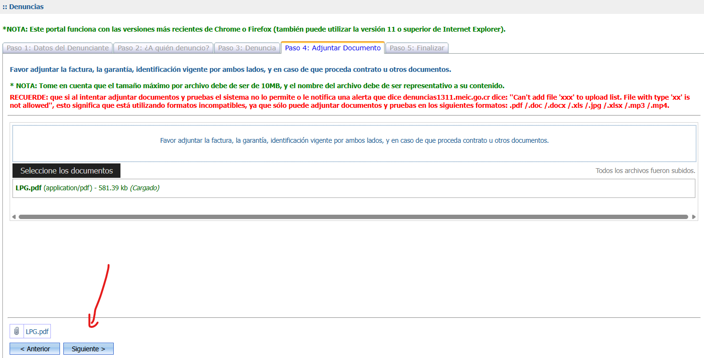

# Como crear una denuncia en el MEIC (Costa Rica)

- MEIC es el Ministerio de Economía, Industria y Comercio (MEIC)
- Son los encargados de los espectáculos públicos.

# En este blog usted aprenderá a

- Crear una demanda hacia una denuncia hacia un negocio, entidad jurídica o sociedad anónima.
- Como ejemplo de referencia, vamos a tomar el caso de LPG Productions y Artem Totem Media.

# Caso de referencia: LPG Productions y Artem Totem Media

## Quiénes son? Que hacen?
- LPG es una "productora" de eventos metal (en su mayoría) en Costa Rica.
- Artem Totem media es otra entidad paralela que también se encargada de vender viajes y tours a eventos de música.
- Ambas entidades son de los mismos dueños.

## De qué se le acusan a estas entidades? 

- [LPG | Extreme Fest 8: Evento cancelado, más de 2 meses sin devolver dinero de las entradas](https://eventos.cr/evento/25-10-09-extreme-fest-viii).
    - Fuente: Ver screenshots en apéndice.
- [LPG | Extreme Fest 7: Evento cancelado, más de 2 meses sin devolver dinero de las entradas](https://eventos.cr/evento/25-09-13-extreme-fest-vii).
    - Fuente: Ver screenshots en apéndice.
- [Arte Totem Media | Oasis: Sueño de pasear a México termina en pesadilla
](https://www.diarioextra.com/noticia/sueno-de-pasear-a-mexico-termina-en-pesadilla/)
    - *Víctimas denuncian situación, perdieron más de $1.200 cada uno*
    - Fuente: Diario Extra.
- Arte Totem Media | Mexico Metal Fest 2023: Deuda de $500 a cada uno de los que compraron el paquete de viaje que ofrecían.
    - Fuente: Comunidad Metalera.

## Deuda apróximada

| Evento                 | Costo del tiquete o paquete de viaje | Cantidad aprox de clientes | Total de ganacia |
|------------------------|--------------------------------------|----------------------------|------------------|
| Extreme Fest 8         | $30                                  | 200                        | $6000            |
| Extreme Fest 7         | $30                                  | 500                        | $15000           |
| Oasis                  | $1200                                | 10                         | $12000           |
| Mexico Metal Fest 2023 | $500                                 | 10                         | $5000            |
| -                      | -                                    | -                          | **$38000**       |

Según los cálculo con números promedio, la deuda se aproxima a $40 mil dólares ~ 20 millones de colones.

# Cómo denunciar

## Paso 0. qué necesito tener listo antes de subir la demanda?

- Registrarse en el MEIC.
- Un PDF con las imágenes de pagos, entradas, comprobantes y recibos de la estafa o fraude, ya que el sistema solo acepta este formato.
- La información de la entidad a demandar y sus colaboradores.
    - Este tutorial usted podrá encontrar esta información, no hace falta que la busque en medios externos.

## Paso 1. Registrarse en el MEIC

- Ir a [Portal de Denuncias del MEIC](https://denuncias1311.meic.go.cr/Denuncias/frmLogin.aspx).
- Click en *Registrarse*.
- Crearse una cuenta.

### Confirmación

## Paso 2. Ingresar al portal del MEIC

- Ir a [Portal de Denuncias del MEIC](https://denuncias1311.meic.go.cr/Denuncias/frmLogin.aspx).
- Ingresar con cédula y contraseña.
- Clickear en el botón **SIN FIRMA DIGITAL**.

## Paso 3. Ingresar al portal del MEIC

- Una vez incresado, click en **Presente su denuncia aquí**

## Paso 4. Datos del denunciante

- Similar al registro, ingrese sus datos como denunciante.

## Paso 5. A quién denuncio?

### Ingresar datos de LPG y miembros de la productora.

En Datos del Denunciante, incresar información de la entidad jurídica a demandar. 

- En este caso: LPG Productions.
    - Seleccionar cédula jurídica.
    - Número de identificación: 
        - **3-102-902935**.
    - Teléfono: 
        - **6403-2010**.
    - Provincia: 
        - **San José**.
    - Cantón: 
        - **Central**.
    - Distrito: 
        - **DELA TAOPACHULA 150E CASA AZUL**.

- En Denunciados Adicionales, agregar cédula y nombre de los dueños y colaboradores que afectaron a los usuarios, en este ejemplo se agregan a:
    - Kevvin, dueño de LPG.
    - Josue, hermano del dueño y colaborador de LPG.
    - Usar screenshot de arriba como guía.

## Paso 6. Denuncia

- En el caso de conciertos entradas o tours, seleccione "No Encontrado" en *"Bien o servicio"* y especifique su caso.
- Sientase libre de escribir su propia descripción o hacer un copy-paste

    LPG Productions canceló muchos eventos masivos, en específico conciertos de metal.

    Prometieron devolver el dinero de las entradas pero no lo han hecho, muchos usuarios estamos afectados y sin el dinero de vuelta.

    Se estima una deuda de aproximadamente 20millones.

    No quieren hacerse responsables.

    En los documentos adjuntos se muestran capturas de las entradas compradas porr digiticket.shop y pantallazos de SINPES y depósitos hacia la cuenta de Kevvyn (dueño de LPG Productions, denunciado y mencionado en la sección anterior)

    Ver caso en: https://github.com/burninhellhptas/como-denunciar-en-meic

## Paso 7. Adjunte evidencia

- La página solo acepta formatos .doc o .pdf
- Recomendación:
    - En Word o Google Docs (google drive - crear nuevo doc) añada todas las fotos.
    - Guarde o descargue el documento como PDF.

- Click en **Seleccione Documentos**.
- Seleccione el archivo PDF con las imágenes.
- Click en Cargar.

## Paso 8. Finalizar

- Marcar el check.
- Click siguiente.
- Click en Finalizar Formulario.
- Click en Descargar Formulario.

Felicidades, usted aprendió cómo demandar a una entidad jurídica en el sistema del MEIC.

## 9. Apéndice - interacciones con LPG Productions en redes sociales

